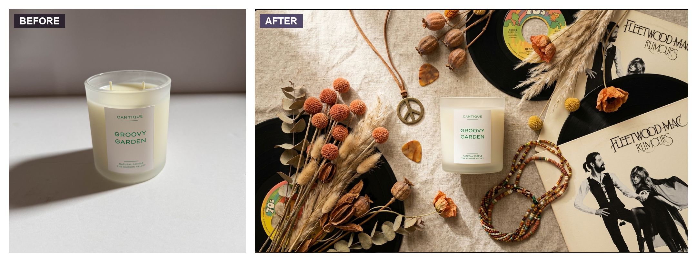
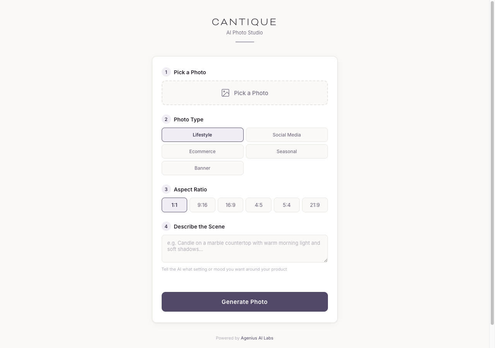
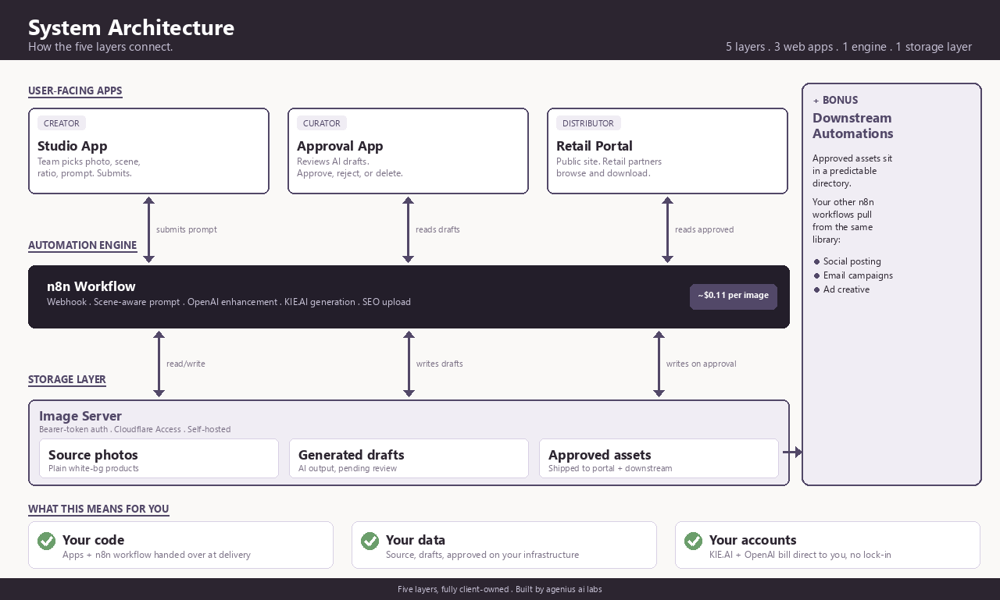

# AI Product Photo Studio (n8n)

Turn a plain product photo into a styled studio shot from a single n8n form. Upload a photo, pick a look, describe the scene, and an image-to-image model re-renders it into a professional product or lifestyle shot. No front end to build, no server to host. About **$0.11 per image**, all in.



The product on the left is a phone snapshot. The one on the right came out of this workflow. The model only changes the scene, lighting, and styling around the product. It never alters the product itself.

---

## What it does

```
Upload a photo  →  pick scene + ratio  →  describe the scene  →  download the result
```

- **Pick a Photo** — jpg, png, or webp, straight from the n8n form.
- **Photo Type** — Flatlay, Hero Image, Ecommerce, or Banner. Each one steers the lighting and composition.
- **Aspect Ratio** — 1:1, 9:16, 16:9, 4:5, 5:4, 21:9.
- **Describe the Scene** — one line of plain English. Optional. An OpenAI agent expands it into a full photography prompt for you.

The finished image is shown on the form's completion screen with a download link.

## What you need

Two credentials. That's the whole setup.

1. **[KIE.AI](https://kie.ai)** API key — runs the image upload, generation, and polling. This is where the per-image cost lands.
2. **OpenAI** API key — turns your one-line scene into a detailed, model-ready photography prompt. Uses `gpt-4.1-mini` by default.

You also need an n8n instance ([self-hosted](https://docs.n8n.io/hosting/) or [Cloud](https://n8n.io/cloud/)). Everything else is in the workflow file.

## Setup (about 5 minutes)

1. In n8n, **Import from File** and select [`ai-product-photo-studio.json`](ai-product-photo-studio.json).
2. Create an **HTTP Bearer Auth** credential with your KIE.AI API key. Select it on the three KIE.AI HTTP nodes: `Upload Input to KIE`, `Create Task`, `Poll Task Status`.
3. Create an **OpenAI** credential and select it on the `OpenAI Chat Model` node.
4. **Activate** the workflow.
5. Open the **Production URL** from the `On form submission` trigger. That's your studio.

## How it works



1. **Form submission** captures the photo and the options.
2. **Upload to KIE.AI** turns the uploaded file into a temporary public URL the model can read.
3. **OpenAI agent** expands the Photo Type plus your scene description into a dense, professional photography prompt. It is instructed to describe only the target scene, lighting, and composition, never the product.
4. **nano-banana-2** (image-to-image) re-renders the product in the new scene.
5. **Poll** every 5 seconds until the image is ready or fails.
6. **Show result** on the form completion screen with a link to the full-size image.

## What it costs

| Item | Cost |
|---|---|
| KIE.AI per image (1K to 4K) | $0.04 to $0.09 |
| OpenAI prompt enhancement | ~$0.05 |
| **Average all-in per image** | **~$0.11** |
| n8n | $0 self-hosted, or Cloud starter |

A single product shoot pays for a few thousand of these.

> **Heads up:** KIE.AI uploaded files and result URLs are **temporary** (they expire after a few days). Save anything you want to keep, or wire in durable storage (see below).

## Build on top of it

This workflow is the generation engine, kept deliberately small so it's easy to read and fork. A few directions people take it:

- **Durable storage.** The result URL is temporary. Add an HTTP node after `Generated Image` that pushes the image to [Imgur](https://apidocs.imgur.com/) (free Client-ID, returns a permanent hotlinkable URL), an S3/R2 bucket, Google Drive, or Dropbox, so links don't expire.
- **A real front end.** Drive the workflow from your own web app instead of the n8n form. Have it POST to the workflow's webhook and poll your storage for the finished image.
- **Batch mode.** Swap the form trigger for a Google Sheet or Airtable trigger and generate a whole catalog in one run.
- **More scenes.** The scene presets live in the `AI Agent` system prompt. Add Holiday, Studio Black, On-Model, or whatever fits your category.
- **Resolution and format.** Defaults to `1K` png in the `Flatten Body` node. Bump it to 2K or 4K there.
- **An approval step.** Add a human-in-the-loop gate (Slack, Telegram, or an n8n form) before an image gets saved to your "keep" library.

## What I built with it

I originally built this for [Cantique](https://www.instagram.com/cantiquecandle/), a candle brand, where shipping fresh product photography for every scent and every channel was a real bottleneck. The public workflow here is the **generation layer** at the center of a larger system.



The full build wrapped this engine with a source-photo library, a scene-picker studio app, an approval queue, and a retail-partner portal so partners could pull approved assets themselves. That's a build problem, not a workflow problem, and most people don't need it. The engine in this repo is the part that's universally useful, so that's what's open.

If you want to see the rest, the case study and architecture write-up are on [ageniusailabs.com](https://ageniusailabs.com).

## License

MIT. Use it, fork it, ship it. See [LICENSE](LICENSE).

## Who built this

[Michael Frostbutter](https://ageniusailabs.com), founder of Agenius AI Labs. I build AI automation systems for small operators and write up the ones worth sharing.
