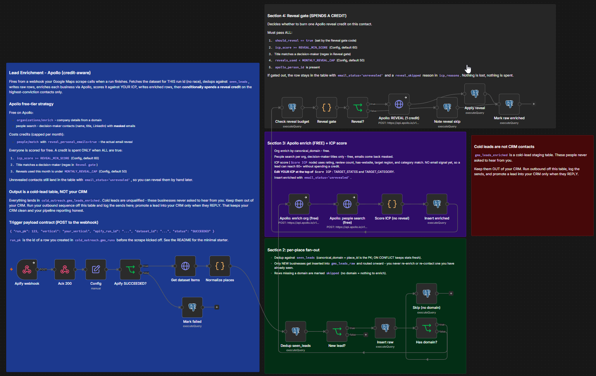

# Lead Enrichment - Apollo (credit-aware)

> Turn a raw Google Maps business scrape into a scored, deduplicated cold-lead table. Enrich every business through Apollo's **free** endpoints, score each against your ICP for free, and spend a paid email-reveal credit only on the highest-conviction contacts, under a hard monthly cap.

[](https://ageniuslabs.com) [](LICENSE)



## Why this exists

Buying enrichment credits by the thousand is how most people burn their budget on leads that were never going to convert. Apollo gives you a lot for free: company details from a domain, and decision-maker contacts (name, title, LinkedIn) with the email masked. The only thing that costs a credit is revealing the actual email.

So this workflow does all the free work first, scores every business against your ideal customer profile using signals that cost nothing, and spends a reveal credit **only** when a lead clears your score bar, has a decision-maker title, and you are still under your monthly cap. Everything else lands in the table unrevealed, ready for a manual reveal later if you want it.

## What it does

1. Your Google Maps scrape finishes and calls the workflow's webhook with the run id.
2. It pulls that run's dataset, **dedups** against a `seen_leads` ledger so you never touch the same business twice, and stores the raw rows.
3. For each new business with a domain, it hits Apollo's **free** org-enrich and people-search endpoints (decision-maker titles only, masked emails).
4. It **scores** each business against your ICP: rating, review count, has-a-website, target region, category match. No email needed, so a lead can clear the bar for free.
5. The **reveal gate** spends one Apollo credit only when the lead passes all of: score at or above your threshold, a decision-maker title, and the monthly cap not yet hit.
6. Everything lands in `cold_outreach.gms_leads_enriched`, your cold-lead table.

## The important part: this is a cold-lead table, not your CRM

The output is a staging table of **unqualified** cold leads. These businesses never asked to hear from you. Do not pour them into your CRM, it pollutes your contact list and wrecks your pipeline reporting.

The pattern that keeps things clean:

- Your outbound sequence reads from `gms_leads_enriched` and **logs the sends** (to this table or wherever you track outreach).
- A lead becomes a real CRM contact **only when they reply**. That is the moment they stop being cold.

This one boundary is why the workflow writes to its own schema and never assumes a CRM on the other end. Wire the reply-to-CRM promotion however your stack does it.

## What you need

- **n8n** (self-hosted or Cloud).
- **A Google Maps scrape source.** This template is built around [Apify](https://apify.com) running a Google Maps Scraper actor, but any scraper works as long as something POSTs the trigger contract below and exposes a dataset of places. The workflow reads the dataset with an Apify dataset URL by default.
- **An Apollo account** ([apollo.io](https://www.apollo.io)). The free tier covers org enrich and people search; email reveals draw from your monthly credit allowance. Set the cap in the workflow to match your plan.
- **Postgres** for the four tables (schema included). Any Postgres 12+ works.
- **A trigger.** Something has to create a run row and call the webhook when the scrape finishes. See [The trigger contract](#the-trigger-contract).

None of the credentials are bundled. You attach your own.

## Setup

> **Setting up with an AI assistant?** Paste [`AI-SETUP-PROMPT.md`](AI-SETUP-PROMPT.md) into Claude / ChatGPT / Gemini and it interviews you through the whole deployment, including writing your ICP (target states, target categories, score thresholds) from what your business actually sells. Recommended.

### 1. Create the database schema
Apply [`sql/schema.sql`](sql/schema.sql) to your Postgres database. It creates the `cold_outreach` schema and all four tables in one shot.

### 2. Import the workflow
`apollo-lead-enrichment.json` -> **Import from File** in n8n.

### 3. Attach credentials (none are bundled)
- **Postgres** on every database node (they all use one connection).
- **HTTP Query Auth** (your Apify API token as the `token` query param) on `Get dataset items`.
- **HTTP Header Auth** (`X-Api-Key: <your Apollo key>`) on the three Apollo nodes.

### 4. Set your ICP (the step that matters)
Open the **`Score ICP`** node. The top of the file is a clearly marked block:

```js
const TARGET_STATES   = ['NY', 'NJ', 'CT'];                 // regions you sell into; [] disables the geo signal
const TARGET_CATEGORY = /(consult|agency|studio|service)/i; // Google-category words that signal a fit
const MIN_RATING      = 4.0;
const MIN_REVIEWS     = 50;
```

Each of the five signals is worth 20 points (100 max). Edit these to describe **your** ideal customer. A lead needs three of five to reach 60, which is the default reveal threshold.

Then, in the **`Apollo: people search`** node and the **`Reveal gate`** node, adjust the decision-maker titles if your buyer has a different title than owner / founder / principal / partner / director.

### 5. Set your budget
Open the **`Config`** node:
- `MONTHLY_REVEAL_CAP` (default 50) - match your Apollo credit allowance.
- `REVEAL_MIN_SCORE` (default 60) - the ICP score a lead must hit before you spend a credit.

### 6. Wire the trigger
Point your scrape's completion webhook at the workflow's `Apify webhook` node (path `maps-lead-enrich-inbound`). See below.

## The trigger contract

The workflow starts from a single POST. Whatever kicks off your scrape is responsible for creating a `gms_runs` row first and then calling this webhook when the run finishes:

```
POST https://YOUR-N8N/webhook/maps-lead-enrich-inbound
Content-Type: application/json

{
  "run_pk": 123,                 // id of the cold_outreach.gms_runs row you created
  "vertical": "your_vertical",   // free-form label for this scrape
  "apify_run_id": "abc123",
  "dataset_id": "xYz...",        // the dataset the workflow will read
  "status": "SUCCEEDED"          // anything else marks the run failed
}
```

The minimal starter is: (1) `INSERT INTO cold_outreach.gms_runs (vertical, status) VALUES ('...', 'running') RETURNING id;`, (2) start your Apify actor with that id in the payload, (3) let Apify's own run-finished webhook (or a second small n8n workflow) POST the contract above. The Apify Google Maps Scraper can call a webhook on finish and include its `resource.defaultDatasetId`, which maps straight to `dataset_id`.

## What is in the workflow

Four labeled sections, documented inline on the canvas:

| Section | What it does |
|---|---|
| **Intake** | Webhook -> ack 200 -> Config -> check the run succeeded (else mark the run failed). |
| **Section 2: per-place fan-out** | Fetch the dataset, normalize each place, dedup against `seen_leads`, insert new raw rows, skip rows with no domain. |
| **Section 3: Apollo enrich (FREE) + ICP score** | Org enrich + people search (both free, masked emails), then score against your ICP. Insert enriched rows as `unrevealed`. |
| **Section 4: Reveal gate (SPENDS A CREDIT)** | Check the monthly budget, gate on score + title + cap, reveal the email for winners only, note the skip reason for the rest. |

## Customize

- **Your ICP** lives entirely at the top of the `Score ICP` node. This is the one place with business-specific logic.
- **Decision-maker titles** are in `Apollo: people search` (who to look for) and `Reveal gate` (who is worth a credit). Keep the two lists aligned.
- **Budget knobs** (`MONTHLY_REVEAL_CAP`, `REVEAL_MIN_SCORE`) are in `Config`.
- **A different scraper?** Replace `Get dataset items` with your source and keep `Normalize places` mapping its fields into the same shape. Everything downstream is source-agnostic.
- **Name shortening** for outreach ("Smith & Co" from "Smith & Co., LLC") is a small suffix list at the top of `Normalize places`. Add your own patterns.

## Notes

- This is the published/sanitized version: credentials are omitted and the schema ships as `schema.sql` for you to run. Nothing about your data or accounts is baked in.
- A failed reveal (out of credits, API error) does not hang or drop the lead. It flows through and marks the row `email_status='unknown'`, so you can see the attempt.
- Unrevealed contacts are not wasted. They sit in the table with `email_status='unrevealed'` and their skip reason in `icp_reasons`, ready for a manual reveal whenever you decide one is worth it.

## Who built this

[Michael Frostbutter](https://ageniuslabs.com), founder of Agenius AI Labs. 25+ years in network engineering and technology operations. Built this to run cold outreach for one of my own businesses without lighting my enrichment budget on fire.

## License

MIT, see [LICENSE](LICENSE). Use it however you want.
