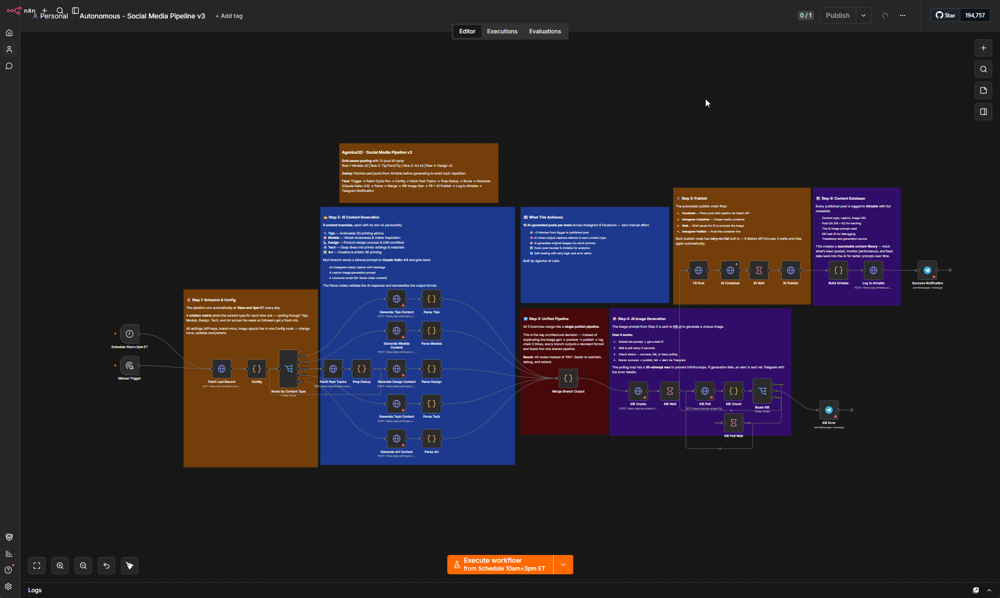

# Autonomous Social Media Pipeline

A scheduled social content engine for **any vertical**. On a schedule it picks the next slot in a 12-post Instagram grid cycle, writes a caption + image prompt with an LLM (Claude Haiku by default), generates an original image, publishes to Facebook + Instagram, logs to Airtable, and pings you on the messaging platform of your choice.

It ships wired for Telegram, but the notification step is just a message-out node: point it at Slack, Discord, Telegram, or any incoming webhook and it works the same. You set up the one you already use.

Adapt it to your industry by editing **one node**. Cost is dominated by image generation (a few cents per post) plus a fraction of a cent for the LLM call.



## Flow

```
Schedule / Manual
  → Fetch last cycle position (Airtable)
  → Config (your vertical + 5 topics + posting cycle)
  → Fetch recent posts (Airtable, for topic dedup)
  → Prep Prompt (builds the prompt from the selected topic)
  → Generate Content (LLM) → Parse Content
  → KIE.ai image gen (create → wait → poll → check → route)
  → Facebook photo post → Instagram container → publish
  → Log to Airtable
  → Telegram success notification
```

The design is fully **config-driven**: the five content topics used to live in five hardcoded branches, now they're data in the `Config` node and a single generator builds the prompt from whichever topic the cycle selected. To retarget the whole pipeline at a different industry, you edit only `Config`.

## What you need

- n8n (self-hosted or Cloud)
- **Anthropic** API key (Claude Haiku writes the content)
- **KIE.ai** API key (image generation, this is where most of the per-post cost lands)
- **Meta Graph API** access token for a Facebook Page linked to an Instagram Business account
- **Airtable** account (content cycle state + published-post log)
- A **messaging platform** for notifications: Telegram out of the box, or Slack / Discord / any incoming webhook (see Customize)

## Setup

### 1. Import
`autonomous-social-media-pipeline.json` → **Import from File** in n8n.

### 2. Attach credentials (none are bundled)
- **Anthropic** on the `Generate Content` node.
- **HTTP Bearer Auth** (your KIE.ai key) on `KIE Create` and `KIE Poll`.
- **Telegram** on `KIE Error` and `Success Notification`.

### 3. Set n8n variables (Settings → Variables)
- `AIRTABLE_PAT` — Airtable personal access token
- `META_PAGE_ACCESS_TOKEN` — long-lived Meta Page access token

### 4. Configure your vertical (the important step)
Open the **Config** node — it's the only node with industry-specific content. Set:
- `vertical`, `brand`, `brandVoice` — who you are and what space you're in
- `topics` — your **five** content topics, each with a `label`, an `angle` (editorial instruction), `subtopics` (rotated for variety), and `hashtags`
- `cycle` — the 12-slot posting pattern, referencing your topic keys (`t1`–`t5`)

Then fill the placeholders, also in `Config`: `YOUR_TELEGRAM_CHAT_ID`, `YOUR_AIRTABLE_BASE_ID`, `YOUR_AIRTABLE_TABLE_ID`, `YOUR_META_PAGE_ID`, `YOUR_META_IG_USER_ID`. Finally, replace `YOUR_AIRTABLE_BASE_ID` / `YOUR_AIRTABLE_TABLE_ID` in the URLs of the three Airtable HTTP nodes (`Fetch Last Record`, `Fetch Past Topics`, `Log to Airtable`).

The `topics` `label` values become the options in the Airtable **Type** field, so keep them consistent with your table.

### 5. Create the Airtable table
Import [`airtable/content-table.csv`](airtable/content-table.csv) into your base to stand up the table in one click, then set the field types per [`airtable/SCHEMA.md`](airtable/SCHEMA.md). The table tracks published posts and drives the cycle/dedup logic.

### 6. Activate
The schedule fires at 10am and 3pm (cron `0 0 10,15 * * *`, server timezone). Use the **Manual Trigger** to test a single run first.

## Customize

- **Your vertical + topics** live entirely in the `Config` node (`vertical`, `brandVoice`, `topics`). This is the only place with industry-specific wording, change it and the whole pipeline retargets.
- **The grid cycle** is the `Config` node's `cycle` array. Reorder or resize it to change what posts when (it doesn't have to be 12 slots).
- **Swap the LLM:** `Config.llmModel` sets the Claude model; to use a different provider, point the `Generate Content` HTTP node at another API.
- **Any messaging platform:** it ships wired for Telegram (`KIE Error`, `Success Notification`), but those are just message-out nodes. Swap them for a Slack node, a Discord node, or an HTTP POST to any incoming webhook and everything upstream is unchanged. Wire up the one you already use.
- **Image specs** (model, aspect ratio, resolution) are in `Config` (`kieModel`, `kieAspectRatio`, `kieResolution`).

## Notes

- This is the published/sanitized version: an internal logging node and a dashboard webhook trigger were removed, and all account IDs, chat IDs, and credentials were replaced with placeholders. Triggers are schedule + manual only.
- The five per-topic branches from the original were collapsed into a single config-driven generator, so adapting it to a new industry means editing one node instead of rewriting five prompts.
- The KIE poll loop caps at 30 attempts (~2.5 min) then routes to a Telegram error alert, so it never hangs forever.

## License

MIT
