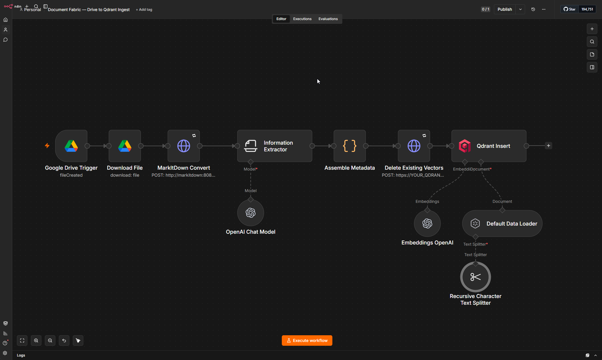

# Document Fabric — Drive to Qdrant Ingest

The ingestion half of a high-accuracy RAG pipeline. Drop a document into a Google Drive folder and it gets normalized, tagged, chunked, embedded, and made searchable in Qdrant, automatically.



## Flow

```
Google Drive Trigger (new file in folder)
  → Download File
  → MarkItDown Convert (any format → Markdown)
  → Information Extractor (doc-level metadata via a cheap LLM)
  → Assemble Metadata + content hash (Code)
  → Delete existing vectors for this file_id (idempotent upsert)
  → Qdrant Insert  [Default Data Loader + Recursive Splitter + OpenAI Embeddings]
```

## Why it's built this way

- **Markdown-first normalization.** Every source (PDF, Word, HTML, Google Doc) is converted to one clean structure before anything else. Headings become real section boundaries and tables survive, which is what makes structure-aware chunking possible instead of blind character splitting.
- **Metadata tagged at the document level, before chunking.** `product_line`, `sku`, `doc_type`, `effective_date`, `audience`, plus deterministic fields from Drive. Because it's tagged before the split, every chunk inherits it. That's what lets a retrieval layer filter to the right slice *before* running the semantic search.
- **Delete-then-insert upsert.** Existing chunks for a `file_id` are cleared before re-inserting, so a changed document never leaves stale vectors behind. A `content_hash` rides along in metadata for later dedup.

## Requirements

- n8n (self-hosted or cloud)
- A Markdown converter service reachable over HTTP ([MarkItDown](https://github.com/microsoft/markitdown), [Docling](https://github.com/DS4SD/docling), or [Unstructured](https://unstructured.io))
- [Qdrant](https://qdrant.tech)
- OpenAI API key (embeddings + a cheap model for metadata extraction)
- Google Drive OAuth2 credential

## Setup

1. Import `workflow.json`.
2. **Credentials:** attach Google Drive OAuth2 (trigger + Download File), OpenAI (Chat Model + Embeddings OpenAI), and your Qdrant credential (Qdrant Insert). None are bundled.
3. **Folder:** set `YOUR_DRIVE_FOLDER_ID` on the Google Drive Trigger.
4. **MarkItDown:** point the HTTP node's URL at your converter. It expects a JSON response shaped `{ "markdown": "..." }`. If yours returns raw text or a different field, adjust the Information Extractor's `text` expression and the Code node's `.json.markdown` reference.
5. **Qdrant:** set `YOUR_QDRANT_HOST` and a `QDRANT_API_KEY` env var. Create the `product_knowledge` collection at **3072 dimensions** (matches `text-embedding-3-large`) before the first run.
6. Activate the workflow.

## Notes & extensions

- **Google Docs** are not binary. If you're watching a folder of native Google Docs (rather than uploaded PDFs/Word files), add an export format in the Download File node's options or the download will error. Uploaded files work as-is.
- **Skip-if-unchanged gate:** the `content_hash` is already computed and stored. To avoid re-embedding unchanged docs, add an IF before the delete that compares the hash against a log store (Postgres or an n8n Data Table). Left out here so the template runs without extra infrastructure.
- **Deletions:** this workflow doesn't see file deletes. Add a small companion workflow on the Drive `fileDeleted` event that deletes Qdrant points by `file_id`.
- **Retrieval side:** keep retrieval in a separate, low-latency workflow. This template is ingestion only.

## License

MIT
