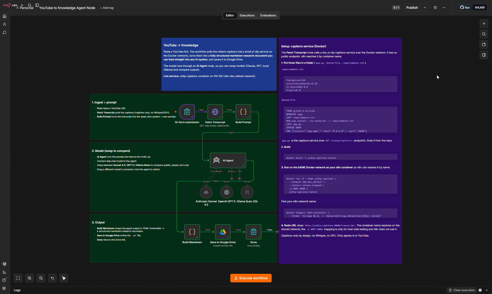

# YouTube → Knowledge



Paste a YouTube link into a form and get a fully structured markdown research document saved to Google Drive. The workflow pulls the video's captions, runs them through an **AI Agent** that produces a deep-dive, transcript-grounded breakdown, and files the result in Drive as a `.md` you can feed straight into any AI system (RAG ingestion, a second agent, Claude Projects, and so on).

## Flow

```
Form (YouTube URL)
  → Fetch Transcript (yt-dlp captions service)
  → Build Prompt (deep-dive system + user prompt)
  → AI Agent (swappable chat model)
  → Build Markdown (frontmatter + breakdown)
  → Save to Google Drive (Create From Text)
  → Completion screen with the Drive link
```

The agent produces a deep-dive document with eight sections: thesis, step-by-step walkthrough, verbatim commands/code/config, a numbers & benchmarks table, tools/people/resources named, direct quotes, gotchas & caveats, and how to apply or reproduce it. It is instructed to preserve exact numbers, commands, and names, and never to fabricate.

## Swap models to compare

The model is an **AI Agent** node, so any chat model plugs into it. The template ships three set up as alternates, **Anthropic Claude Sonnet 4.5**, **OpenAI GPT-5**, and a **local Ollama (Qwen)**, so you can run the same transcript through each and compare quality, speed, and cost. An agent uses one model at a time: drag a different model's connector onto the agent's **Chat Model** input to switch.

## Why a captions service (not the YouTube API)

YouTube's official Data API `captions.download` only works for videos **you own** (OAuth). To transcribe any public link you need [yt-dlp](https://github.com/yt-dlp/yt-dlp), which discovers and downloads the caption track YouTube already serves. Running yt-dlp inside n8n is awkward (and impossible on n8n Cloud), so this template calls a tiny HTTP service that wraps it. The service lives in [`service/`](service/); build it and point the workflow at it.

Captions-only: no Whisper/GPU. Videos with captions disabled return a `422` and the run fails cleanly.

## What you need

- n8n (self-hosted or Cloud)
- The **yt-dlp captions service** from [`service/`](service/), reachable over HTTP
- **At least one chat-model credential** for the AI Agent: Anthropic, OpenAI, or a local Ollama endpoint (mix and match to compare)
- **Google Drive** OAuth2 credential

## Setup

1. **Deploy the service**: see [`service/README.md`](service/README.md). Note its URL.
2. **Import** `youtube-to-knowledge.json` into n8n.
3. **Fetch Transcript**: set the URL to your service, e.g. `http://ytdlp-captions:8080/transcript`.
4. **AI Agent**: attach a chat model. Open one of the model nodes (Anthropic / OpenAI / Ollama), add your credential, and confirm its connector runs to the agent's **Chat Model** input. Only the connected model runs.
5. **Save to Google Drive**: attach your **Google Drive** credential and set the target folder (`YOUR_DRIVE_FOLDER_ID`).
6. Open the form's **Production URL** and paste a link.

The sticky notes on the canvas walk through each stage and the captions-service Docker setup.

## AI-assisted setup

Not sure how to wire it against your own stack? See [`AI-SETUP-PROMPT.md`](AI-SETUP-PROMPT.md): paste the block into any reasoning LLM and it interviews you through deployment.

## Customize

- **Auto-filing:** classify the document into a topic folder before saving by adding a small LLM call + a Drive folder lookup.
- **Other sinks:** swap the Drive node for Notion, S3, or an n8n knowledge/RAG ingestion workflow.
- **Long videos:** very long transcripts can exceed the model's output budget; chunk + map-reduce, or raise the model's max output tokens.
- **Shallower/faster:** point the agent at a cheaper model (Haiku, a mini tier, or a small local model) for a quick summary instead of the full deep dive.

## License

MIT
